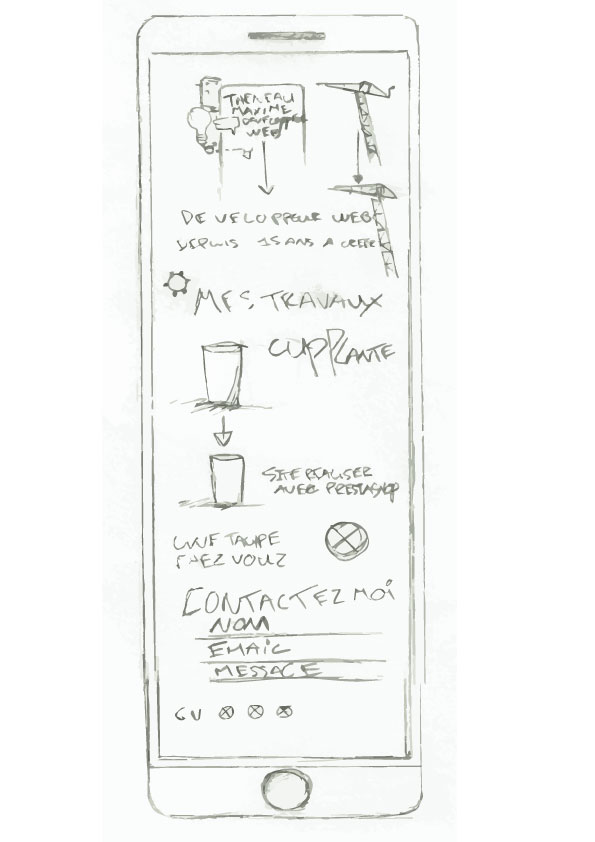

# Theneau Maxime Portfolio
Portfolio Développeur Web à Marseille, réaliser en Mobile First intégralement en paralax avec React / React-Redux.

## [Demo](https://github.com/MaximeThe/Maximethe.github.io)

## Langages utilisés

- React (18.1.0), React-Redux
- JavaScript, JSX
- SASS, SCSS
- HTML5/CSS

## Wireframe

